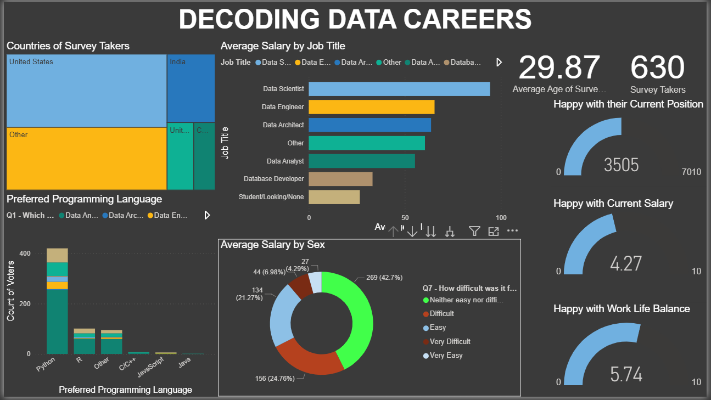

# Decoding Data Careers: A Power BI Analysis
This project, "Decoding Data Careers," provides an in-depth analysis of various data-related careers using Power BI. 
-The analysis focuses on understanding career satisfaction, salary trends, and other key metrics across different countries. 📊

## Project Overview
The project is built around a comprehensive dataset and leverages the powerful features of Power BI to deliver insightful visualizations. 

## The key components of the analysis include:

### Power Query:
-Used for transforming and cleaning the data. 
-The analysis utilizes Power Query to handle tasks such as country-wise data transformation, ensuring consistency and accuracy across the dataset.

### Country-Wise Analysis: 
-An examination of data career metrics on a country-by-countrybasis. 
-This section explores how factors like salary, job satisfaction, and required skills vary geographically. 
-A world map visualization is used to display these insights effectively. 🗺️

### Happiness Measures: 
-A detailed breakdown of career happiness and satisfaction scores. 
-The analysis identifies key factors that contribute to higher job satisfaction among data professionals.

## Overall Metrics: 
-The dashboard presents a holistic view of the data careers landscape, including average salaries, popular job titles, and a breakdown of skills and experience levels.

## PowerBI Dashboard

## How to Use This File
To view and interact with the full dashboard, you will need to open the Power BI file (.pbix) included in this repository.

Download and Install: Ensure you have Power BI Desktop installed on your system.

Open the File: Double-click the Decoding_Data_Careers.pbix file.

Explore: Navigate through the different pages of the report to explore various visualizations, apply filters, and gain insights into the data.

Also You can create your own dashboards by using the dataset provided

